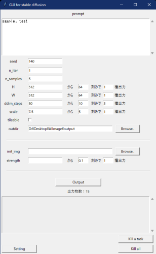
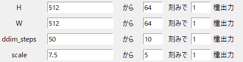
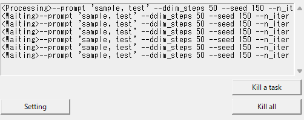
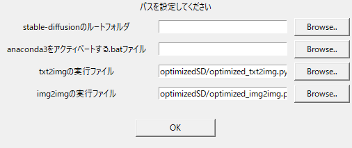

# SimpleGUI_for_stable_diffusion
anaconda3で環境構築済みの人向けのシンプルなGUIです。  
GUIからコマンドを実行して、stable_diffusionのoptimized版を動かします。  
Windows用です。  



性質上、コマンドプロンプトから手動で実行できる状態になっていないと機能しません。  
コマンドを手打ちするより多少楽にしたい、という程度の目的で作りました。  

パラメータを入力して「Output」ボタンで出力します。  
outdirを設定しない場合はデフォルトのstable-diffusion\outputsに出力されます。

# 機能


複数の条件でまとめて出力できます。  



キューで一つずつ処理するので、一度に負荷がかかることはありません。  
Waitingにあるタスクは中止できます。

保存したフォルダにログテキストが生成されます。  

promptやパスにダブルクォーテーションが混ざっていても大丈夫です。（除去して読み取ります）  

# 環境構築
https://zenn.dev/koyoarai_/articles/02f3ed864c6127bb2049  
こちらの記事を参考にさせていただきました。  
```
conda env create -f environment.yaml
conda activate ldm
```
が通るようになっていればOKです。  

# 起動～初期設定
start.pyとbat.batを任意のフォルダに入れ、start.pyをダブルクリックして起動します。 

  

Settingボタンから上記の４つのパスを設定してください。  
> stable-diffusionのルートフォルダ  

直下にoptimizedSDなどのフォルダがある、stable-diffusionという名前のフォルダです。  
> anacondaをアクティベートする.batファイル  

C:\Users\（ユーザー名）\anaconda3\Scripts\activate.bat　などです。  
> 実行ファイル  

自動で設定されますが、デフォルトから移動している場合は手動で設定してください。  

# tileable
tileable（シームレス出力）は実行ファイルに手を加えないと機能しません。  

https://gitlab.com/-/snippets/2395088

上記の6～10行目をコピーし、optimized_text2img.pyの20行目あたりに貼り付けます。  
その直後に

```
def tileable():
	for klass in [torch.nn.Conv2d, torch.nn.ConvTranspose2d]:
		patch_conv(klass)
```

を加えます。  
parser.add.argument()が並んでいる箇所に
```
parser.add_argument(
    "--tileable", 
    action="store_true",
    help="Tileable",
)
```

を加えます。  
opt = parser.parse-args()の直後に  
```
if opt.tileable == True:
	tileable()
```

を加えます。  
これでオプションに--tileableが追加され、GUIではチェックボックスでONにできます。  
optimized_img2img.pyも同様にします。

# その他
コマンドを実行した後のエラーは取得しないので、  
何も生成されない場合は黒い画面を見てエラーを確認してください。  
メモリ不足の場合はn_stepsを減らすと生成できることがあります。  
空欄があっても出力できますが、WやHが64の倍数になっていない等は不可です。


2022/9/10  
ログテキスト機能を追加しました  
ログテキストの名前が重複してしまうのを直しました  
パスに日本語があると読めないのを直しました   
promptの改行を無視するようにしました  
2022/9/12  
init_imgが空の時でも枚数計算に入っていたのを直しました  
